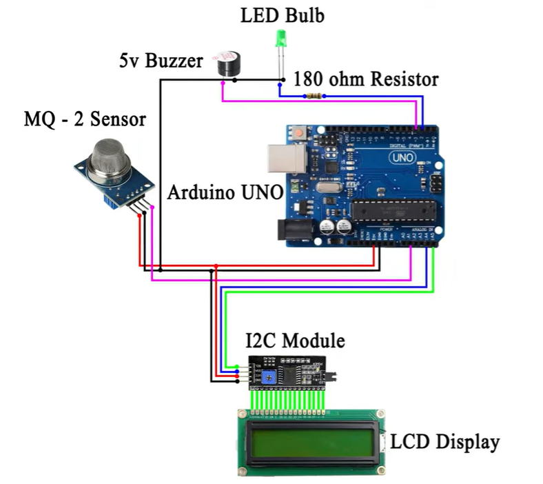
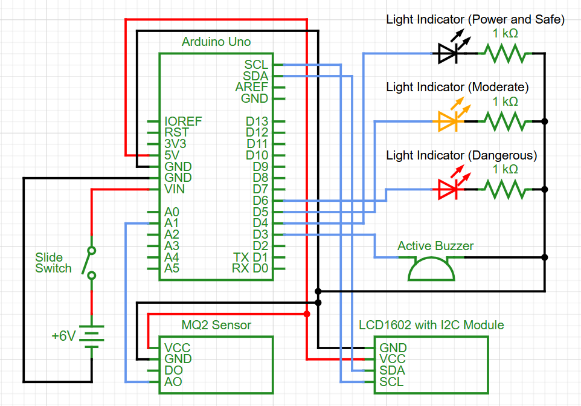

# Gas and Smoke Detector Project

## Overview

This project is an Arduino-based gas and smoke detector designed as part of a final case study for the **Digital Design** course. The system uses an MQ2 sensor to detect gas and smoke levels and displays the readings on an LCD1602 screen. When dangerous levels of gas or smoke are detected, the system triggers an LED and a buzzer as warning indicators.

## Features

- **Gas and Smoke Detection**: Utilizes the MQ2 sensor to monitor gas and smoke levels.
- **Visual Display**: Displays real-time sensor readings on an LCD1602 screen.
- **Warning System**: Activates an LED and a buzzer when gas or smoke levels exceed a safe threshold.

## Main Components Used

1. **Arduino Uno**: Microcontroller board for processing sensor data.
2. **MQ2 Sensor**: Gas and smoke sensor for detecting harmful substances.
3. **LCD1602 Screen**: I2C-based display for showing sensor readings.
4. **LED**: Visual indicator for gas/smoke detection.
5. **Buzzer**: Audible alarm for gas/smoke detection.
6. **Resistors and Wires**: For circuit connections.

## Circuit Diagram

The circuit connects the MQ2 sensor, LCD1602 screen, LED, and buzzer to the Arduino Uno. Ensure proper wiring and connections as per the pin definitions in the code.

## Schematic Diagram

### Credits

- This project followed the YouTube Tutorial: [MQ2 sensor with Arduino UNO](https://www.youtube.com/watch?v=hSYCt7LrYxQ)

© 2025 Aron-Arboleda. All rights reserved.
