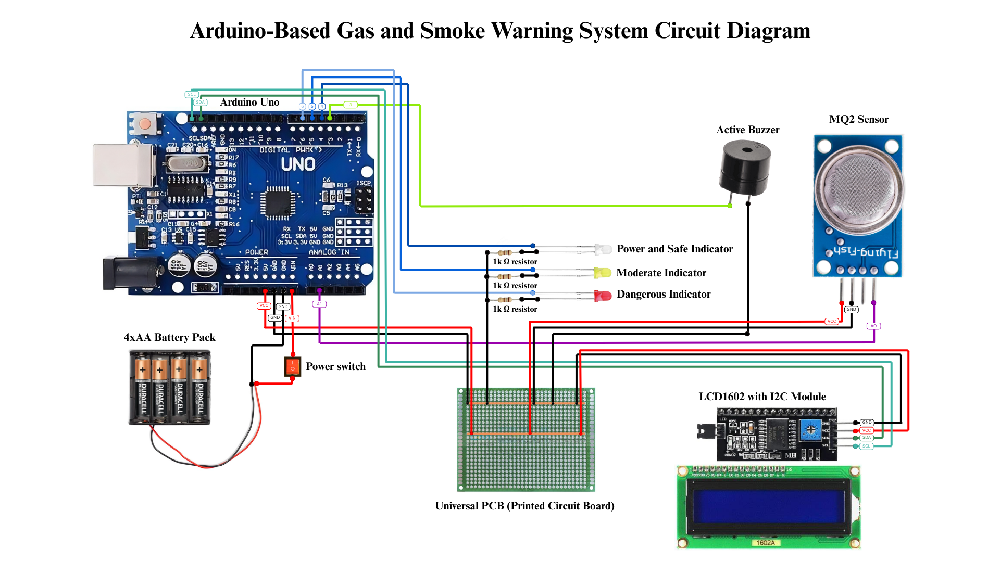

# Gas and Smoke Detector Project

## Overview

This project is an Arduino-based gas and smoke detector designed as part of a final case study for the **Digital Design** course. The system uses an MQ2 sensor to detect gas and smoke levels and displays the readings on an LCD1602 screen. When dangerous levels of gas or smoke are detected, the system triggers an LED and a buzzer as warning indicators.

## Features

- **Gas and Smoke Detection**: Utilizes the MQ2 sensor to monitor gas and smoke levels.
- **Visual Display**: Displays real-time sensor readings on an LCD1602 screen.
- **Warning System**: Activates an LED and a buzzer when gas or smoke levels exceed a safe threshold.

## Main Components Used

1. **Arduino Uno**: Microcontroller board for processing sensor data.
2. **MQ2 Sensor**: Gas and smoke sensor for detecting harmful substances.
3. **LCD1602 Screen**: I2C-based display for showing sensor readings.
4. **LED**: Visual indicator for gas/smoke detection.
5. **Buzzer**: Audible alarm for gas/smoke detection.
6. **Resistors and Wires**: For circuit connections.

## Circuit Diagram

The circuit connects the MQ2 sensor, LCD1602 screen, LED, and buzzer to the Arduino Uno. Ensure proper wiring and connections as per the pin definitions in the code.


(ctto: [Science Buddies](https://www.youtube.com/watch?v=hSYCt7LrYxQ))

## Code Explanation

The project code is written in C++ and uses the Arduino framework. Below is a summary of the key functionality:

1. **Setup**:
   - Initializes the serial communication, LCD screen, and pin modes for the LED and buzzer.
2. **Loop**:
   - Reads the analog value from the MQ2 sensor.
   - Displays the sensor value on the LCD screen.
   - Activates the LED and buzzer if the sensor value exceeds a threshold (400).

### Code Snippet

```cpp
#include <Arduino.h>
#include <LCD_I2C.h>

LCD_I2C lcd(0x27);

#define LED 2
#define Buzzer 3
#define Sensor A1

void setup() {
  Serial.begin(9200);
  lcd.begin();
  lcd.backlight();
  pinMode(LED, OUTPUT);
  pinMode(Buzzer, OUTPUT);
}

void loop() {
  int value = analogRead(Sensor);
  lcd.setCursor(0, 0);
  lcd.print("Value :");
  lcd.print(value);

  if (value > 400) {
    digitalWrite(LED, HIGH);
    digitalWrite(Buzzer, HIGH);
    lcd.setCursor(0, 1);
    lcd.print("GAS Detected!");
  } else {
    digitalWrite(LED, LOW);
    digitalWrite(Buzzer, LOW);
    lcd.setCursor(0, 1);
    lcd.print("             ");
  }
}
```

### Credits

- This project followed the YouTube Tutorial: [MQ2 sensor with Arduino UNO](https://www.youtube.com/watch?v=hSYCt7LrYxQ)

© 2025 Aron-Arboleda. All rights reserved.
